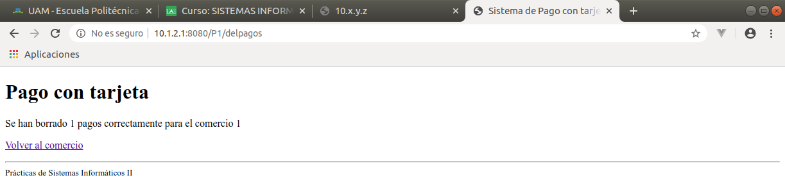
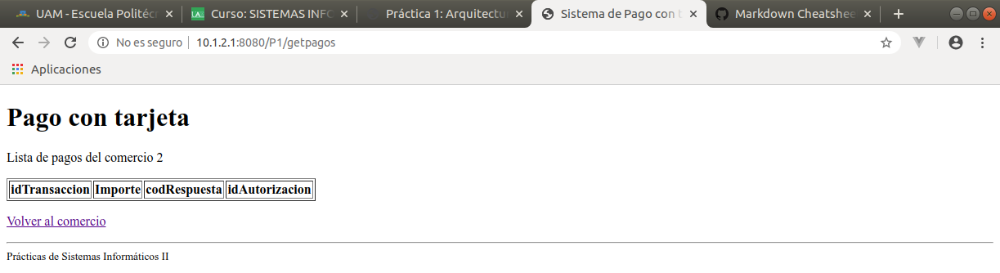

### Ejercicio 1

En primer lugar, modificamos los archivos build.propierties y postgresql.properties usando nuestra ip 10.1.2.1, junto con la contraseña alumnodb de la base de datos.
Una vez hecho esto, iniciamos la máquina virtual y el servidor de glassfish, y usando ant y build.xml desplegamos la aplicación mediante los comandos compilar, empaquetar, desplegar y regenerar-bd.
Abrimos Tora y comprobamos que inicialmente la base de datos está vacía:ç+

Una vez realizamos un pago, el servidor nos devuelve el comprobante y en la base de datos aparece:


Borramos y obtenbemos:



### Ejercicio 2
Para la conexion directa, modificamos JDBC_DRIVER  JDBC_CONNSTRING JDBC_USER y JDBC_PASSWORD de DBTester.java como indica el apéndice 10, replegamos la base de datos y ejecutamos el todo de build.xml.




### Ejercicio 3
Entramos en la consola de administración de glassfish y comprobamos los rescursos JDBC y el Pool de conexiones, obteniendo lo siguiente:


TODO: Explicar que es cada parametro de la captura.


### Ejercicio 4
Buscamos el código dentro del fichero VisaDAO.java:
El método para comprobar si una tarjeta es válida se encuentra en la función `public boolean compruebaTarjeta(TarjetaBean tarjeta)`, en la línea 133. Dentro de este método, en función de si se utiliza un prepared statement o no, se usa el código SQL incluido en `SELECT_TARJETA_QRY` o `getQryCompruebaTarjeta(tarjeta);`
java```
private static final String SELECT_TARJETA_QRY =
                "select * from tarjeta " +
                "where numeroTarjeta=? " +
                " and titular=? " +
                " and validaDesde=? " +
                " and validaHasta=? " +
                " and codigoVerificacion=? ";

String getQryCompruebaTarjeta(TarjetaBean tarjeta) {
    String qry = "select * from tarjeta "
                + "where numeroTarjeta='" + tarjeta.getNumero()
                + "' and titular='" + tarjeta.getTitular()
                + "' and validaDesde='" + tarjeta.getFechaEmision()
                + "' and validaHasta='" + tarjeta.getFechaCaducidad()
                + "' and codigoVerificacion='" + tarjeta.getCodigoVerificacion() + "'";
    return qry;
}
```


El método para ejecutar el pago, se encuentra en la función `public synchronized boolean realizaPago(PagoBean pago)`, en la línea 206.
En ninguna de las funciones se incluye código SQL de forma directa, se crean preparedStatements
