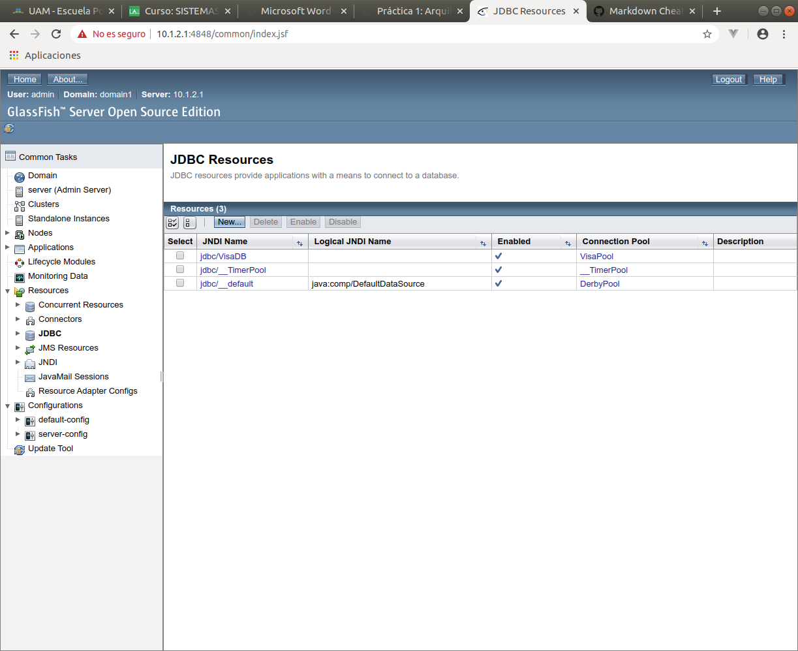
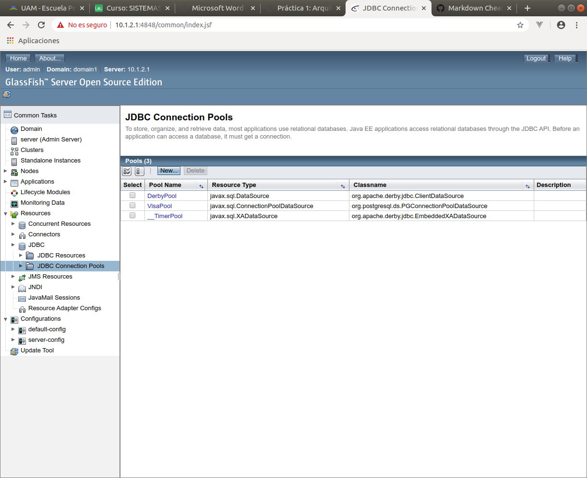
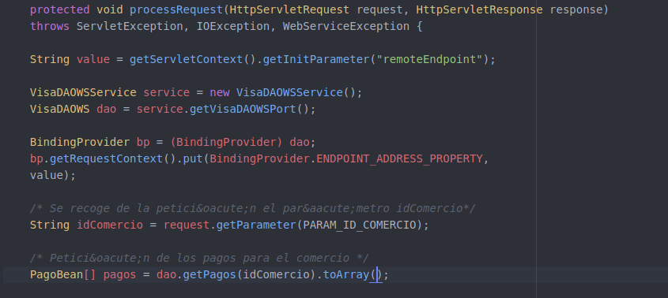
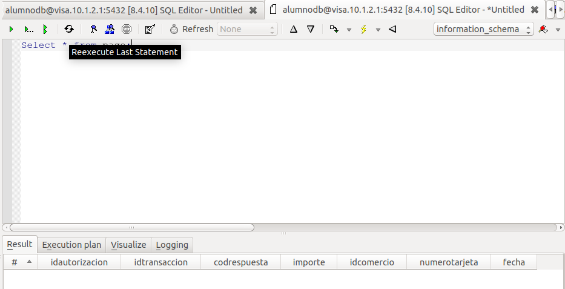

###### Javier Delgado del Cerro y Javier López Cano

# Memoria P1A

### Ejercicio 1

En primer lugar, modificamos los archivos build.propierties y postgresql.properties usando nuestra ip 10.1.2.1, junto con la contraseña alumnodb de la base de datos.
Una vez hecho esto, iniciamos la máquina virtual y el servidor de glassfish, y usando ant y build.xml desplegamos la aplicación mediante los comandos compilar, empaquetar, desplegar y regenerar-bd.
Abrimos Tora y comprobamos que inicialmente la base de datos está vacía:


Una vez realizamos un pago, el servidor nos devuelve el comprobante y en la base de datos aparece:


Borramos y obtenemos:


El funcionamiento de la aplicacción al realizar estas acciones es el esperado, por tanto el sistema funciona correctamente.

### Ejercicio 2

Para la conexion directa, modificamos JDBC_DRIVER  JDBC_CONNSTRING JDBC_USER y JDBC_PASSWORD de DBTester.java como indica el apéndice 10, replegamos la base de datos y ejecutamos el todo de build.xml.

Ahora realizamoos un pago:


Listamos los pagos y comprobamos que aparece el pago que acabamos de realizar:


Eliminamos el pago:


Por último listamos los pagos del comercio de nuevo, y observamos que el pago que hemos eliminado no aparece:


El comportamiento del sistema al realizar estas actividades es el esperado, lo que nos lleva a la conclusión de que los parámetros introducidos para establecer la conexión directa con la base de datos son correctos.

### Ejercicio 3

Entramos en la consola de administración de glassfish y comprobamos los rescursos JDBC y el Pool de conexiones, obteniendo lo siguiente:






Al realizar el ping, este es exitoso, por tanto vemos que la conexión con la base de datos funciona correctamente.

Cabe destacar que los parámetros Initial pool size y máximun pool size definen el número máximo de conexiones simultáneas que puede haber en un momento dado con la base de datos. Esto reprecute en el número de peticiones de los clientes que podrán ser satisfechas a la vez de forma paralela, y por tanto, afecta a la velocidad en que estas se responden.

Pool resize quantity e idle timeout son parámetros que definen como se comportará el pool ante cuando se cumple un cierto tiempo sin que se emplee una conexión con la base de datos. Cuando pasa el tiempo especificado en idle time sin emplear una conexión, el sistema eliminará 2 conexiones del pool (las especificadas en pool resize quantity), siempre que queden activas más conexiones que las mínimas especificadas en el initial pool size.

Por último el max wait time indica el tiempo máximo de espera que tiene la petición de un cliente antes de expirr. Esto quiere decir que si pasa este tiempo sin ser procesada la petición, esta expira, y por tanto no será procesada. Esto contribuye a evitar la congestión del sistem con peticiones irresolubles o excesivamente costosas.

### Ejercicio 4

Buscamos el código dentro del fichero VisaDAO.java:
El método para comprobar si una tarjeta es válida se encuentra en la función `public boolean compruebaTarjeta(TarjetaBean tarjeta)`, en la línea 133. Dentro de este método, en función de si se utiliza un prepared statement o no, se usa el código SQL incluido en `SELECT_TARJETA_QRY` o `getQryCompruebaTarjeta(tarjeta);` respectivamente.
```java
private static final String SELECT_TARJETA_QRY =
    "select * from tarjeta " +
    "where numeroTarjeta=? " +
    " and titular=? " +
    " and validaDesde=? " +
    " and validaHasta=? " +
    " and codigoVerificacion=? ";

String getQryCompruebaTarjeta(TarjetaBean tarjeta) {
    String qry = "select * from tarjeta "
                + "where numeroTarjeta='" + tarjeta.getNumero()
                + "' and titular='" + tarjeta.getTitular()
                + "' and validaDesde='" + tarjeta.getFechaEmision()
                + "' and validaHasta='" + tarjeta.getFechaCaducidad()
                + "' and codigoVerificacion='" + tarjeta.getCodigoVerificacion() + "'";
    return qry;
}
```

El método para ejecutar el pago, se encuentra en la función `public synchronized boolean realizaPago(PagoBean pago)`, en la línea 206. Al igual que en la función comentada anteriormente, se utiliza el código SQL incluido en `INSERT_PAGOS_QRY` en el caso de que el query se ejecute como prepared statement, o bien la función `getQryInsertPago(pago)` en aso contrario.
```java
private static final String INSERT_PAGOS_QRY =
    "insert into pago(" +
    "idTransaccion,importe,idComercio,numeroTarjeta)" +
    " values (?,?,?,?)";

String getQryInsertPago(PagoBean pago) {
    String qry = "insert into pago("
                + "idTransaccion,"
                + "importe,idComercio,"
                + "numeroTarjeta)"
                + " values ("
                + "'" + pago.getIdTransaccion() + "',"
                + pago.getImporte() + ","
                + "'" + pago.getIdComercio() + "',"
                + "'" + pago.getTarjeta().getNumero() + "'"
                + ")";
    return qry;
}
```


### Ejercicio 5

Dentro de VisaDAO.java, se llama a `errorLog` en las funciones `compruebaTarjeta`, `realizaPago`, `getPagos` y `delPagos` para distinguir entre las distintas posibilidades de cada función (si se usa o no un prepared statement, o si falla). Una vez entramos en `http://10.1.2.1:8080/P1/testbd.jsp` y ejecutamos un pago con la opción debug activada, entramos de nuevo en el log del servidor y podemos apreciar información extra sobre los queries que se han hecho en los campos de detail.


Como era de esperar, en el log observamos información acerca de los queries añadidos en VisaDAO.java.


### Ejercicio 6

Para modificar la función *realizaPago* de modo que devuelva el pago modificado o *null*, hemos tenido que cambiar:

- La línea de declaración de la función, indicando que en vez de un *boolean* devuelve un *PagoBean*.

- La variable *ret* de la función, para que sea de tipo *PagoBean*. Una vez hecho esto, cambiamos todas las asignaciones de la forma `ret = XXX;`, de modo que cuando `XXX` es *false*, lo cambiamos por *null*, y cuando es *true*, lo cambiamos por *pago*, la variable de entrada de la función.

  De esta forma, al ser correcto el pago, este se actualiza directamente, y como *ret* apunta al objeto *pago*, la función devuelve el *PagoBean* con la información actualizada.

Se altera el parámetro de retorno para que el cliente ser Web Service pueda tener y usar la información del id de autorización y el código de respuesta directamente, sin necesidad de hacer otra petición distinta al servidor, agilizando así el procedimiento.

### Ejercicio 7

Observamos que este fichero wsdl.xml define los mensajes intercambiados en la invocación de los métodos java del servicio, y también cabe destacar que establece cuales són los métodos java del servicio que se pueden ejecutar desde la página, y cuales son los `input` que inician cada uno de ellos. Por tanto, básicamente define que accioes activan las llamadas a cada uno de los métodos java del servicio web.

Los tipos de dato intercambiados con el web service se encuentran definidos en el fichero:
http://dao.visa.ssii2/ 
Localizado en:
http://10.1.2.1:8080/P1-ws-ws/VisaDAOWSService?xsd=1

Los tipos de dato predefinidos que se emplean son:
string, boolean, double e int.

Los tipos de dato que se definen son:
compruebaTarjeta, compruebaTarjetaResponse,delPagos, delPagosResponse, errorLog, errorLogResponse, getPagos, getPagosResponse, isDebug, isDebugResponse, isDirectConnection, isDirectConnectionResponse, isPrepared, isPreparedResponse, realizaPago, realizaPagoResponse, setDebug, setDebugResponse, setDirectConnection, setDirectConnectionResponse, setPrepared, setPreparedResponse, tarjetaBean y pagoBean.

Los tipos de dato (tanto los predefinidos como los que se predefinen) podemos observarlos el el fichero 

http://10.1.2.1:8080/P1-ws-ws/VisaDAOWSService?xsd=1

Al observar este fichero, los tipos predefinidos vienen precedidos de `xs:` mientras que los que se definen en el fichero vienen precedidos por `tns:` de este modo se consigue que los tipos de dato predefinidos sean fácilemnte diferenciables de los propios a simple vista en el archivo.

El archivo xml también facilita la identificación de los distintos elementos con el uso de varias etiquetas facilmente diferenciables:

La etiqueta asociada a los métodos invocados en el web service es `<operation>`.

La etiqueta que describe los mensajes intercambiados en la invocación de los métodos del web service es `<mesage>`.

El protocolo de comunicación se especifica en la etiqueta `<soap:binding>`.

La URL a la que se tiene que conectar un cliente para acceder al web service se especifica en la etiqueta `<soap:address>`.

De nuevo estas etiquetas facilitan enormemente la diferenciación a simple vista de los distintos elementos y secciones del archivo xml.


### Ejercicio 8

Las modificaciones que hemos tenido que realizar han sido:
- Añadir los imports necesarios para poder usar el servicio remoto:
```java
import ssii2.visa.VisaDAOWSService; // Stub generado automáticamente
import ssii2.visa.VisaDAOWS; // Stub generado automáticamente
import javax.xml.ws.WebServiceRef;
import javax.xml.ws.WebServiceException;
import javax.xml.ws.BindingProvider;
```
y eliminar el anterior import de VisaDAO.
- Inicializar el nuevo VisaDAOWS mediante el código:
```java
VisaDAOWSService service = new VisaDAOWSService();
VisaDAOWS dao = service.getVisaDAOWSPort();
```
- A la hora de comprobar el resultado de la función *realizaPago*, usar:
```java
dao.realizaPago(pago) == null
```
- Por último, añadimos la clase `WebServiceException` al *throws* del método.

  
### Ejercicio 9

Los comentarios del fichero `web.xml` nos indican cuales son los distintos métodos para inicialzar servlets, los parámetros de contexto de estos, y los distintos filtros que se pueden aplicar.

En primer lugar,  los parámetros de contexto se inicializan con la siguiente sentencia:

```java
String value = getServletContext().getInitParameter("nombre");
```

También se nos indica que la función para obtener los parámetros de incialización de los servlets es:

```java
String value = getServletConfig().getInitParameter("nombre");
```

Y los parámetros de inicialización del filtro con:

```java
String value = filterconfig.getInitParameter("nombre");
```

En conclusión, los comentarios del web.xml nos muestra el funcionamiento de la applicación web y como acceder a los parámetros necesarios para su correcta inicialización mediante sentencias de java.


### Ejercicio 10

Realizamos en *delPagos.java* y *GetPagos.java* las mismas modificaciones que en el ejercicio 8, y el código es el siguiente:
*DelPagos.java*

*GetPagos.java*, añadimos también el paso a Array de `dao.getPagos(idComercio)`

Modificamos además el archivo *VisaDAOWS.java* para que los métodos *getPagos* y *delPagos* sean servicios web, y para que
el método *getPagos* devuelva un objeto de clase *ArrayList<PagoBean>* en vez de un *PagoBean[]*, haciendo que se devuelva la variable *pagos* que ya estaba inicializada y usada en la función.
Ha sido necesario además importar la clase *java.util.ArrayList;* dentro de *GetPagos.java*.


### Ejercicio 11

Usamos el comando `wsimport -d build/client/WEB-INF/classes -p ssii2.visa http://10.1.2.2:8080/P1-ws-ws/VisaDAOWSService?wsdl`.
Una vez ejecutado el comando, las clases generadas son las mostradas en la siguiente captura de pantalla. Se generan por estar especificadas en el archivo *VisaDAOWSService*, pues son necesarias para que el cliente pueda hacer uso de dichas clases del servidor. **TODO: EXPLICAR BIEN**.


### Ejercicio 12

El código añadido al target *generar-stubs* de *build.xml* para que se añadan las clases y objetos necesarios automáticamente es:
```xml
<exec executable="wsimport">
  <arg value="-d"/>
  <arg value="${build.client}/WEB-INF/classes"/>
  <arg value="-p"/>
  <arg value="${paquete}.visa"/>
  <arg value="http://10.1.2.2:8080/P1-ws-ws/VisaDAOWSService?wsdl"/>
</exec>
```


### Ejercicio 13

Antes de realizar ningún pago en la aplicación, probamos a ejecutar la consulta:
`SELECT * FROM pago`
y comprobamos que no hay pagos realizados pues la salida está vacía.


Realizamos un pago.


y realizamos de nuevo la misma consulta.


Observamos que, en este caso, sí obenemos una salida, que es la correspondiente al pago que acabamos de realizar. Por tanto, el sistema funciona correctamente.


### Cuestiones

##### 1)

Al realizar este caso de uso, se pasa en primer lugar por pago.html, despues el servlet ComienzaPago, de ahi a formdatosvisa.jsp, se envían los datos al servlet ProcesaPago que los valida, y al encontrar el error en la fecha de expiración, nos devuelve al formdatosvisa.jsp con el mensaje de error correspondiente.

##### 2)

De los servlets empleados, el encargado de solicitar la información del pago con tarjeta es tan solo ComienzaPago.
Para validar esta información se emplean:
ProcesaPago, ErrorVisa, ErrorVisaCVV, ErrorVisaFEchaCaducidad, ErrorVisaFechaEmision, ErrorVisaNumero, ErrorVisaTitular y ValidadorTarjeta.

##### 3) 

Al realizar un pago a traves de pago.html, el servlet ComienzaPago solicita al usuario el id de transacción, el id de comercio y el importe, además también solicita la ruta de regreso que es suministrada por el html de forma estática.
Por su parte ProcesaPago solicita al usuario los mismos datos, pero además, el número de tarjeta, las fechas de emisión y caducidad y el código de verificación de esta.
Ambos servlets comparten la información enviándose formularios jsp mediante el método POST, y esta información la almacenan en los objetos "Bean" `pagoBean` y `tarjetaBean`.

##### 4)

Al observar pago.html y testbd.jsp, se observa una gran diferencia a la hora de invocar a los servlets. En pago.html vemos que se llama al servlet comienzapago para iniciar el pago, mientras que en testbd.jsp se llama directamente a procesapago, sin pasar por comienzapago. 
El motivo por el cual el pago a través de testbd.jsp funciona, y no solo el de pago.html, es poque en testbd.jsp, el formulario empleado para llamar a procesapago implementa ya las comprobacionesnecesarias que realizaría comienzapago.