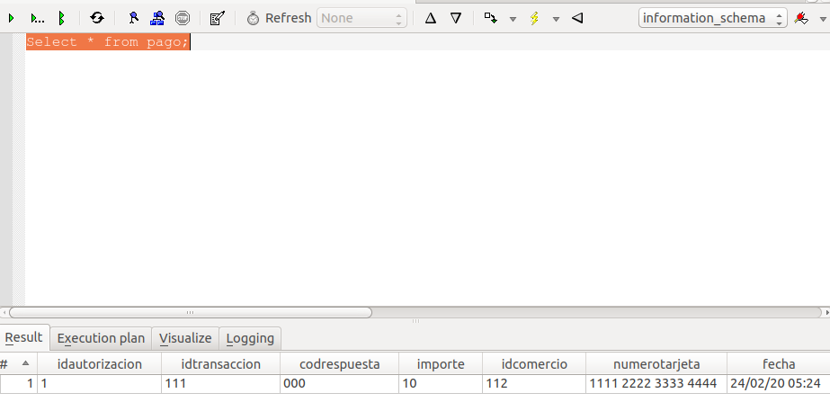

### Ejercicio 1

En primer lugar, modificamos los archivos build.propierties y postgresql.properties usando nuestra ip 10.1.2.1, junto con la contraseña alumnodb de la base de datos.
Una vez hecho esto, iniciamos la máquina virtual y el servidor de glassfish, y usando ant y build.xml desplegamos la aplicación mediante los comandos compilar, empaquetar, desplegar y regenerar-bd.
Abrimos Tora y comprobamos que inicialmente la base de datos está vacía:


Una vez realizamos un pago, el servidor nos devuelve el comprobante y en la base de datos aparece:


Borramos y obtenemos:


### Ejercicio 2
Para la conexion directa, modificamos JDBC_DRIVER  JDBC_CONNSTRING JDBC_USER y JDBC_PASSWORD de DBTester.java como indica el apéndice 10, replegamos la base de datos y ejecutamos el todo de build.xml.


### Ejercicio 3
Entramos en la consola de administración de glassfish y comprobamos los rescursos JDBC y el Pool de conexiones, obteniendo lo siguiente:


TODO: Explicar que es cada parametro de la captura.


### Ejercicio 4
Buscamos el código dentro del fichero VisaDAO.java:
El método para comprobar si una tarjeta es válida se encuentra en la función `public boolean compruebaTarjeta(TarjetaBean tarjeta)`, en la línea 133. Dentro de este método, en función de si se utiliza un prepared statement o no, se usa el código SQL incluido en `SELECT_TARJETA_QRY` o `getQryCompruebaTarjeta(tarjeta);` respectivamente.
```java
private static final String SELECT_TARJETA_QRY =
    "select * from tarjeta " +
    "where numeroTarjeta=? " +
    " and titular=? " +
    " and validaDesde=? " +
    " and validaHasta=? " +
    " and codigoVerificacion=? ";

String getQryCompruebaTarjeta(TarjetaBean tarjeta) {
    String qry = "select * from tarjeta "
                + "where numeroTarjeta='" + tarjeta.getNumero()
                + "' and titular='" + tarjeta.getTitular()
                + "' and validaDesde='" + tarjeta.getFechaEmision()
                + "' and validaHasta='" + tarjeta.getFechaCaducidad()
                + "' and codigoVerificacion='" + tarjeta.getCodigoVerificacion() + "'";
    return qry;
}
```


El método para ejecutar el pago, se encuentra en la función `public synchronized boolean realizaPago(PagoBean pago)`, en la línea 206. Al igual que en la función comentada anteriormente, se utiliza el código SQL incluido en `INSERT_PAGOS_QRY` en el caso de que el query se ejecute como prepared statement, o bien la función `getQryInsertPago(pago)` en aso contrario.
```java
private static final String INSERT_PAGOS_QRY =
    "insert into pago(" +
    "idTransaccion,importe,idComercio,numeroTarjeta)" +
    " values (?,?,?,?)";

String getQryInsertPago(PagoBean pago) {
    String qry = "insert into pago("
                + "idTransaccion,"
                + "importe,idComercio,"
                + "numeroTarjeta)"
                + " values ("
                + "'" + pago.getIdTransaccion() + "',"
                + pago.getImporte() + ","
                + "'" + pago.getIdComercio() + "',"
                + "'" + pago.getTarjeta().getNumero() + "'"
                + ")";
    return qry;
}
```
### Ejercicio 5
Dentro de VisaDAO.java, se llama a `errorLog` en las funciones `compruebaTarjeta`, `realizaPago`, `getPagos` y `delPagos` para distinguir entre las distintas posibilidades de cada función (si se usa o no un prepared statement, o si falla). Una vez entramos en `http://10.1.2.1:8080/P1/testbd.jsp` y ejecutamos un pago con la opción debug activada, entramos de nuevo en el log del servidor y podemos apreciar información extra sobre los queries que se han hecho en los campos de detail.


### Ejercicio 6

Para modificar la función *realizaPago* de modo que devuelva el pago modificado o *null*, hemos tenido que cambiar:

- La línea de declaración de la función, indicando que en vez de un *boolean* devuelve un *PagoBean*.

- La variable *ret* de la función, para que sea de tipo *PagoBean*. Una vez hecho esto, cambiamos todas las asignaciones de la forma `ret = XXX;`, de modo que cuando `XXX` es *false*, lo cambiamos por *null*, y cuando es *true*, lo cambiamos por *pago*, la variable de entrada de la función.

  De esta forma, al ser correcto el pago, este se actualiza directamente, y como *ret* apunta al objeto *pago*, la función devuelve el *PagoBean* con la información actualizada.

Se altera el parámetro de retorno para que el cliente ser Web Service pueda tener y usar la información del id de autorización y el código de respuesta directamente, sin necesidad de hacer otra petición distinta al servidor, agilizando así el procedimiento.

### Ejercicio 7

### Ejercicio 8

Las modificaciones que hemos tenido que realizar han sido:
- Añadir los imports necesarios para poder usar el servicio remoto:
```java
import ssii2.visa.VisaDAOWSService; // Stub generado automáticamente
import ssii2.visa.VisaDAOWS; // Stub generado automáticamente
import javax.xml.ws.WebServiceRef;
import javax.xml.ws.WebServiceException;
import javax.xml.ws.BindingProvider;
```
y eliminar el anterior import de VisaDAO.
- Inicializar el nuevo VisaDAOWS mediante el código:
```java
VisaDAOWSService service = new VisaDAOWSService();
VisaDAOWS dao = service.getVisaDAOWSPort();
```
- A la hora de comprobar el resultado de la función *realizaPago*, usar:
```java
dao.realizaPago(pago) == null
```
- Por último, añadimos la clase `WebServiceException` al *throws* del método.


### Ejercicio 9

### Ejercicio 10
Realizamos en *delPagos.java* y *GetPagos.java* las mismas modificaciones que en el ejercicio 8, y el código es el siguiente:
*DelPagos.java*

*GetPagos.java*, añadimos también el paso a Array de `dao.getPagos(idComercio)`

Modificamos además el archivo *VisaDAOWS.java* para que los métodos *getPagos* y *delPagos* sean servicios web, y para que
el método *getPagos* devuelva un objeto de clase *ArrayList<PagoBean>* en vez de un *PagoBean[]*, haciendo que se devuelva la variable *pagos* que ya estaba inicializada y usada en la función.
Ha sido necesario además importar la clase *java.util.ArrayList;* dentro de *GetPagos.java*.


### Ejercicio 11
Usamos el comando `wsimport -d build/client/WEB-INF/classes -p ssii2.visa http://10.1.2.2:8080/P1-ws-ws/VisaDAOWSService?wsdl`.
Una vez ejecutado el comando, las clases generadas son las mostradas en la siguiente captura de pantalla. Se generan por estar especificadas en el archivo *VisaDAOWSService*, pues son necesarias para que el cliente pueda hacer uso de dichas clases del servidor. **TODO: EXPLICAR BIEN**.


### Ejercicio 12
El código añadido al target *generar-stubs* de *build.xml* para que se añadan las clases y objetos necesarios automáticamente es:
```xml
<exec executable="wsimport">
  <arg value="-d"/>
  <arg value="${build.client}/WEB-INF/classes"/>
  <arg value="-p"/>
  <arg value="${paquete}.visa"/>
  <arg value="http://10.1.2.2:8080/P1-ws-ws/VisaDAOWSService?wsdl"/>
</exec>
```

### Ejercicio 13
Antes de realizar ningún pago en la aplicación, probamos a ejecutar la consulta:
`SELECT * FROM pago`
y comprobamos que no hay pagos realizados pues la salida está vacía.


Realizamos un pago.


y realizamos de nuevo la misma consulta.


Observamos que, en este caso, si obenemos una salida, que es la correspondiente al pago que acabamos de realizar. Por tanto, el sistema funciona correctamente.

### Cuestiones
