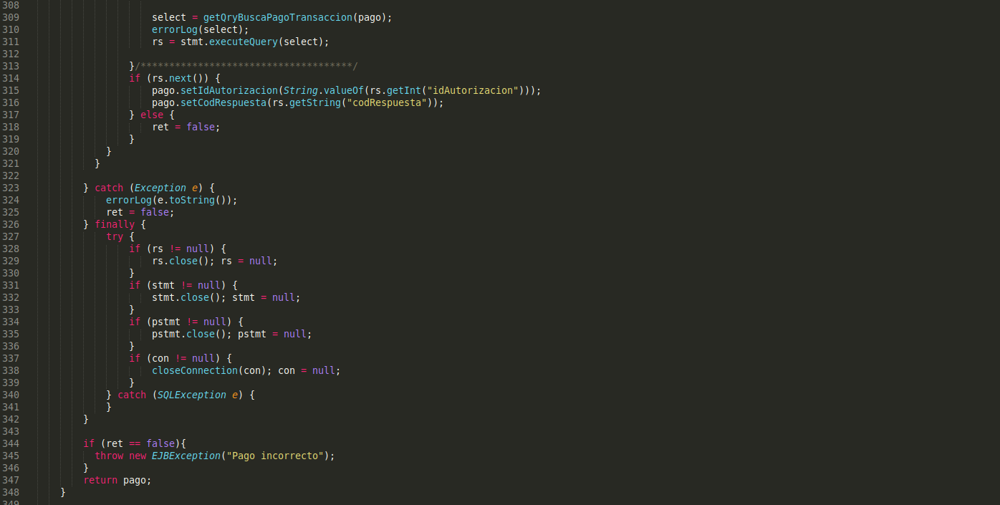
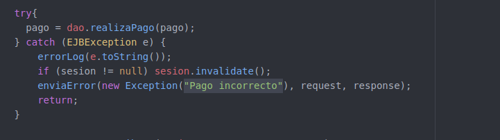
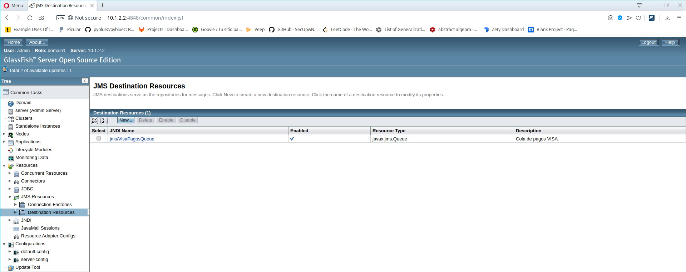

Javier Delgado del Cerro y Javier López Cano

# Memoria P1B

### Cuestión 1

Además de varios imports del paquete `java.sql` y el import de `java.utils.ArrayList`, destaca el `import javax.ejb.local;` junto con la anotación `@Local`. 

Esta anotación especifica que para cualquier clase que implemente esta interfaz, sus métodos EJB que provengan de la interfaz *VisaDAOLocal* solo podrán ser llamados desde un cliente local.

### Ejercicio 1

En primer lugar añadimos el siguiente import en la parte superior del fichero VisaDAOBean.java junto con el resto de los imports:

```java
import javax.ejb.Stateless;
```

Cambiamos la declaración de la clase VisaDAOBean por:

```java
@Stateless(mappedName="VisaDAOBean")
public class VisaDAOBean extends DBTester implements VisaDAOLocal
```

De modo que emplee la anotación `@Stateless` en lugar de `@WebService` e implemente la interfaz `VisaDAOLocal`.

Eliminamos el constructor por defecto de la clase, como se nos indica y ajustamos los métodos a la interfaz, para ello eliminamos todas las anotaciones `@WebMethod` en todos los métodos, y se debe cambiar el retorno del método `getPagos()` de `ArrayList<PagoBean>` a `PagoBean[]` realizando además los cambios necesarios en el método.

De este modo las cabeceras de los métodos modificados quedarán:

```java
public boolean compruebaTarjeta(TarjetaBean tarjeta);
public synchronized PagoBean realizaPago(PagoBean pago);
public PagoBean[] getPagos(String idComercio);
public int delPagos(String idComercio);
public boolean isPrepared();
public void setPrepared(boolean prepared);
public boolean isDebug();
public void setDebug(boolean debug);
public void setDebug(String debug);
public boolean isDirectConnection();
public void setDirectConnection(boolean directConnection);
```


### Ejercicio 2

Tras cambiar los imports que se nos piden, el inicio de `ProcesaPago.java` queda de la siguiente forma:


Tras esto añadimos el objeto proxy para acceder al EJB local con la anotación `@EJB` y .


Por último eliminamos la declaración del webservice *VisaDAOWS* y el código para obtener el objeto remoto pues se usará el EJB local, además eliminamos también las referencias a BindingProvider. Por tanto el código quedará del siguiente modo:


### Cuestión 2

El archivo *application.xml* contiene la siguiente información:

```xml
<?xml version="1.0" encoding="UTF-8"?>
<application version="5" xmlns="http://java.sun.com/xml/ns/javaee" xmlns:xsi="http://www.w3.org/2001/XMLSchema-instance" xsi:schemaLocation="http://java.sun.com/xml/ns/javaee http://java.sun.com/xml/ns/javaee/application_5.xsd">
  <display-name>P1-ejb</display-name>
  <module>
    <ejb>P1-ejb.jar</ejb>
  </module>
  <module>
    <web>
    	<web-uri>P1-ejb-cliente.war</web-uri>
    	<context-root>/P1-ejb-cliente</context-root>
    </web>	
  </module>
</application>
```

Este archivo especifica el nombre de la aplicación que se mostrará en la consola de administración de Glassfish y describe cada uno de sus módulos. 

Especifica entonces que hay dos módulos: 

- El primero contiene un *ejb*, y se indica su nombre.
- El segundo módulo es un elemento web, y se especifica su URI relativa al nivel del package de la aplicación y la ruta sobre la que se despliega este módulo de la aplicación.

Hasta ahora se han generado entonces los ficheros `/dist/server/P1-ejb.jar` y `/dist/client/P1-ejb-cliente.war`. Tras ejecutar el comando `jar -tvf` con ambos, el primero devuelve la siguiente salida:

```
     0 Sat Mar 14 18:56:50 CET 2020 META-INF/
   125 Sat Mar 14 18:56:48 CET 2020 META-INF/MANIFEST.MF
     0 Tue Mar 03 17:55:08 CET 2020 ssii2/
     0 Tue Mar 03 17:55:08 CET 2020 ssii2/visa/
     0 Tue Mar 03 17:55:08 CET 2020 ssii2/visa/dao/
   255 Tue Feb 25 17:13:56 CET 2020 META-INF/sun-ejb-jar.xml
  1464 Tue Feb 25 17:02:36 CET 2020 ssii2/visa/PagoBean.class
   856 Tue Feb 25 17:02:36 CET 2020 ssii2/visa/TarjetaBean.class
   593 Tue Feb 25 17:02:36 CET 2020 ssii2/visa/VisaDAOLocal.class
  1723 Sat Mar 14 18:56:36 CET 2020 ssii2/visa/dao/DBTester.class
  7037 Sat Mar 14 18:56:36 CET 2020 ssii2/visa/dao/VisaDAOBean.class
```

El segundo devuelve:

```
     0 Sat Mar 14 18:57:08 CET 2020 META-INF/
   125 Sat Mar 14 18:57:06 CET 2020 META-INF/MANIFEST.MF
     0 Tue Mar 03 17:55:06 CET 2020 WEB-INF/
     0 Tue Mar 03 17:55:06 CET 2020 WEB-INF/classes/
     0 Tue Mar 03 17:55:06 CET 2020 WEB-INF/classes/ssii2/
     0 Tue Mar 03 17:55:06 CET 2020 WEB-INF/classes/ssii2/controlador/
     0 Tue Mar 03 17:55:06 CET 2020 WEB-INF/classes/ssii2/filtros/
     0 Tue Mar 03 17:55:06 CET 2020 WEB-INF/classes/ssii2/visa/
     0 Tue Mar 03 17:55:06 CET 2020 WEB-INF/classes/ssii2/visa/error/
     0 Tue Feb 25 17:01:28 CET 2020 WEB-INF/lib/
     0 Tue Mar 03 17:55:08 CET 2020 error/
  2844 Tue Feb 25 17:20:08 CET 2020 WEB-INF/classes/ssii2/controlador/ComienzaPago.class
  1513 Tue Feb 25 17:20:08 CET 2020 WEB-INF/classes/ssii2/controlador/DelPagos.class
  1365 Tue Feb 25 17:20:08 CET 2020 WEB-INF/classes/ssii2/controlador/GetPagos.class
  4915 Tue Feb 25 17:20:42 CET 2020 WEB-INF/classes/ssii2/controlador/ProcesaPago.class
  1894 Tue Feb 25 17:20:08 CET 2020 WEB-INF/classes/ssii2/controlador/ServletRaiz.class
  2608 Tue Feb 25 17:20:42 CET 2020 WEB-INF/classes/ssii2/filtros/CompruebaSesion.class
  3170 Tue Feb 25 17:20:42 CET 2020 WEB-INF/classes/ssii2/visa/ValidadorTarjeta.class
   616 Sat Mar 14 18:56:54 CET 2020 WEB-INF/classes/ssii2/visa/error/ErrorVisa.class
   198 Sat Mar 14 18:56:54 CET 2020 WEB-INF/classes/ssii2/visa/error/ErrorVisaCVV.class
   209 Sat Mar 14 18:56:54 CET 2020 WEB-INF/classes/ssii2/visa/error/ErrorVisaFechaCaducidad.class
   207 Sat Mar 14 18:56:54 CET 2020 WEB-INF/classes/ssii2/visa/error/ErrorVisaFechaEmision.class
   201 Sat Mar 14 18:56:54 CET 2020 WEB-INF/classes/ssii2/visa/error/ErrorVisaNumero.class
   202 Sat Mar 14 18:56:54 CET 2020 WEB-INF/classes/ssii2/visa/error/ErrorVisaTitular.class
  6044 Tue Feb 25 17:20:50 CET 2020 WEB-INF/web.xml
   455 Tue Feb 25 17:20:50 CET 2020 borradoerror.jsp
   501 Tue Feb 25 17:20:50 CET 2020 borradook.jsp
   509 Tue Feb 25 17:20:50 CET 2020 cabecera.jsp
   283 Tue Feb 25 17:20:50 CET 2020 error/muestraerror.jsp
  2729 Tue Feb 25 17:20:50 CET 2020 formdatosvisa.jsp
  1257 Tue Feb 25 17:20:50 CET 2020 listapagos.jsp
  1178 Tue Feb 25 17:20:50 CET 2020 pago.html
  1142 Tue Feb 25 17:20:50 CET 2020 pagoexito.jsp
   104 Tue Feb 25 17:20:50 CET 2020 pie.html
  5011 Tue Feb 25 17:20:50 CET 2020 testbd.jsp
```

En ambos casos la salida es la esperada: los archivos y clases necesarios para el servidor y el cliente respectivamente.

### Ejercicio 3

Editamos el fichero `build.properties` colocando en `as.host.client` y `as.host.server` la dirección IP `10.1.2.2`, es decir, la IP del servidor de aplicaciones, esto se debe a que tanto el cliente como el servidor van a desplegarse en la misma máquina virtual.

En el fichero `postgresql.properties` introducimos en el parámetro `db.client.host` la IP `10.1.2.2`, ya que en esta IP estará desplegado el servidor, que es quien accederá a la base de datos , y en el parámetro `db.host` la IP `10.1.2.1` ya que es la IP de la máquina virtual en que estará la base de datos.

Tras esto desplegamos el cliente, el servidor y la aplicación con los comandos:

```bash
$ ant compilar-servidor
$ ant empaquetar-servidor
$ ant compilar-cliente
$ ant empaquetar-cliente
$ ant empaquetar-aplicacion
$ ant desplegar
```

Y al abrir la pestaña de administración de Glassfish y vemos que se ha desplegado como `Enterprise Application`.


### Ejercicio 4

Accedemos a la aplicación para comprobar su correcto funcionamiento.

Realizamos un pago mediante `pago.html` y vemos que se realiza correctamente.


Realizamos ahora uno a través de `testbd.jsp`, sin *directconnection* y vemos de nuevo que funciona correctamente.


Listamos ahora los pagos del comercio 1 para ver que se han guardado en la base de datos correctamente:


Por último eliminamos los pagos y vemos que la acción se ejecuta sin problemas.


Como todas estas acciones han funcionado como se esperaba, deducimos que la aplicación se ha desplegado de forma correcta.


### Ejercicio 5

Realizamos los cambios necesarios en el código para implementar la invocación remota de los métodos de los EJB.

Primero creamos la clase *VisaDAORemote* copiando *VisaDAOLocal* y cambiando el nombre de la interfaz a *VisaDAORemote* y la anotación `@Local` a `@Remote` para que implemente la invocación remota. Para esto es también necesario realizar el import de `Remote` de `java.ejb`. El código por tanto quedará:


Tras esto modificamos *VisaDAOBean* para que implemente también la interfaz *VisaDAORemote*:


Por último modificamos *TarjetaBean* y *PagoBean* para que implementen la interfaz `Serializable` realizando el import correspondiente.

De este modo *PagoBean* quedaría:


Y *TarjetaBean*:


### Ejercicio 6

Para implementar el cliente remoto, partimos de `P1-base` y eliminamos el directorio `ssii2/visa/dao` como se nos indica.

Modificamos *PagoBean* y *TarjetaBean* para que implementen la interfaz `Serializable` del mismo modo que en el ejercicio 5.

Copiamos la interfaz `VisaDAORemote` implementada en el servidor remoto en el ejercicio 5, y la pegamos en el cliente remoto en el directorio `P1-ejb-cliente-remoto/src/ssii2/visa` como se nos indica en el enunciado.

En los servlets eliminamos las declaraciones de `VisaDAO dao` y las sustituimos por referencias al objeto remoto EJB mediante la anotación `@EJB` del mismo modo que en el ejercicio 2, pero con el objeto remoto en lugar del local, realizando tambien los imports necesarios.

Creamos el fichero `glassfish-web.xml` en `web/WEB-INF` e introducimos en este las líneas que se nos indican en el enunciado que especifican las referencias a los EJBs remotos, introduciendo en el lugar adecuado la IP del servidor remoto, que en nuestro caso es `10.1.2.2`.

Desplegamos el cliente en la máquina virtual con IP `10.1.2.1` y realizamos un pago a través de `pago.html`.


Como se observa obtenemos el mensaje indicando que el pago se ha realizado de forma correcta y, por tanto, deducimos que el cliente está correctamente implementado y desplegado.

### Ejercicio 7

En primer lugar, añadimos el atributo *saldo* y sus métodos de acceso a *TarjetaBean.java*:


Tras esto, modificamos el archivo *VisaDAOBean.java* para importar *EJBException*, y declaramos los dos *prepared statements* pedidos:


Modificamos entonces el método *realizaPago*, que queda de la siguiente manera:




Tras esto, modificamos el servlet *ProcesaPago* para que capte la nueva posible interrupción *EJBException*:




### Ejercicio 8

En primer lugar, probamos a hacer un pago correcto y apreciamos en Tora como se ha actualizado el saldo:


Tras esto, probamos a hacer una operación con id de transacción y comercio duplicados y vemos que el saldo no varía, como era de esperar:


### Ejercicio 9

Declaramos en la máquina *10.1.2.2* la factoría de conexiones como se indica:


### Ejercicio 10

De nuevo, declaramos la cola de mensajes en la máquina *10.1.2.2* como se indica en el enunciado:




### Ejercicio 11 ACABAR


### Ejercicio 12

La ventaja de usar el método basado en recursos JMS dinámicos en vez de en estáticos es principalmente que al poder establecer los nombres de la connection factory y de la cola en tiempo de ejecución, puedes usar un servidor externo para obtener dichos nombres, de forma que te permite por ejemplo añadir más colas sin modificar la aplicación, redistribuyendo los clientes.

Las modificaciones hechas en el archivo son las siguientes:


### Ejercicio 13 ACABAR

Añadimos a los campos *as.host.mdb* y *as.host.server* la IPs *10.1.2.2* porque es la máquina en la que se encuentra servidor y las colas de mensajes.

Revisando el fichero *jms.xml* podemos ver que para crear la cola JMS se utiliza:
```xml
<antcall target="create-jms-resource">
   <param name="jms.restype" value="javax.jms.Queue" />
   <param name="jms.resource.property" value="Name=${jms.physname}" />
   <param name="jms.resource.name" value="${jms.name}" />
</antcall>


 <target name="create-jms-resource"
     description="creates jms destination resource">
     <exec executable="${asadmin}">
        <arg line=" --user ${as.user}" />
        <arg line=" --passwordfile ${as.passwordfile}" />
        <arg line=" --host ${as.host.server}" />
        <arg line=" --port ${as.port}" />
        <arg line="create-jms-resource"/>
        <arg line=" --restype ${jms.restype}" />
        <arg line=" --enabled=true" />
        <arg line=" --property ${jms.resource.property}" />
        <arg line=" ${jms.resource.name}" />
     </exec>
 </target>

```

Por tanto, el comando para crear la cola sería
```bash
asadmin --user admin --paswordfile ./passwordfile --host 10.1.2.2 --port 4848 create-jms-resource --restype javax.jms.Queue --enabled=true --property Name=VisaPagosQueue jms/VisaPagosQueue
```

### Ejercicio 14

En primer lugar modificamos *VisaQueueMessageProducer.java* para enviar *args[0]* como mensaje de texto, de forma que el código queda:


Tras esto, detenemos la ejecución de la aplicación *P1-jms-mdb* y una vez ejecutamos `/opt/glassfish4/glassfish/bin/appclient -targetserver 10.1.2.2 -client dist/clientjms/P1-jms-clientjms.jar 1` para enviar a la cola el id de transacción uno, la salida con `/opt/glassfish4/glassfish/bin/appclient -targetserver 10.1.2.2 -client dist/clientjms/P1-jms-clientjms.jar -browse` es la siguiente:


Esto demuestra que el mensaje se ha enviado correctamente.

Modificamos entonces la variable *default_JMS_host* estbleciendo como dirección IP del host la *10.1.2.2*, donde está desplegada la cola de mensajes. Activamos la aplicación *P1-jms-mdb*, reiniciamos el servidor y verificamos que la cola está vacía con el último comando expuesto:


Tras esto, realizamos un pago con la web y vemos que se ha hecho correctamente:


Usamos el cliente para cancelarlo y posteriormente comprobamos que se ha cancelado correctamente, pues la cola está vacía y la información de la base de datos está actualizada (el saldo y el estado del pago con id 2):


