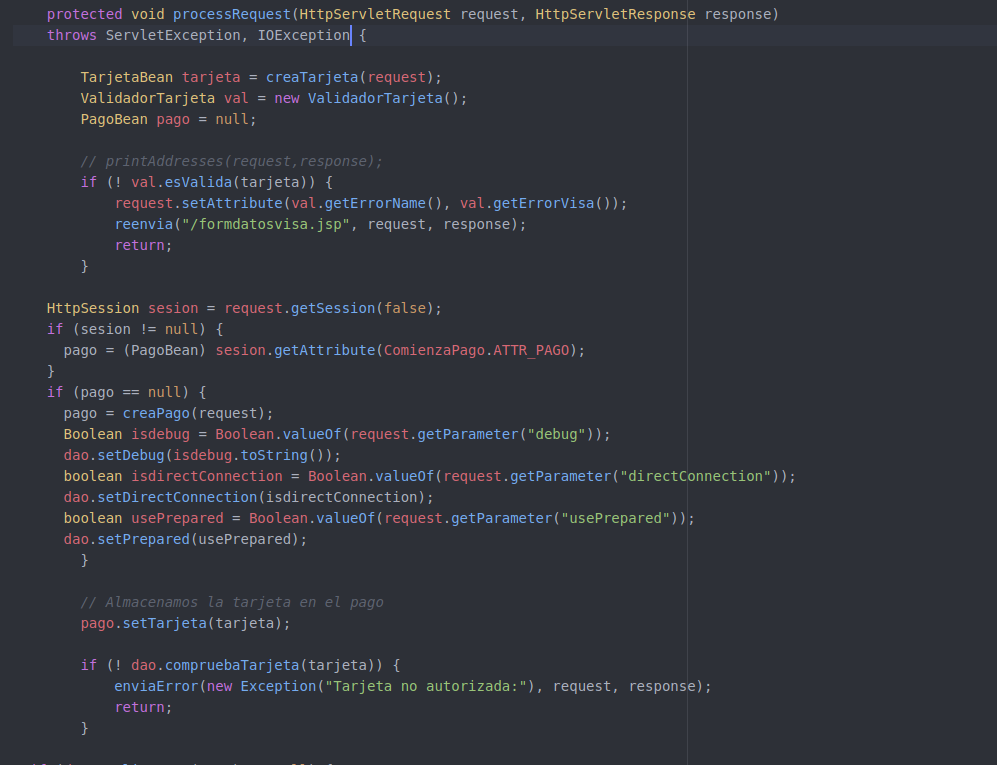

# Memoria P1B

### Cuestión 1

### Ej1

En primer lugar añadimos el siguiente import en la parte superior del fichero VisaDAOBean.java junto con el resto de los imports:

```java
import javax.ejb.Stateless;
```

Cambiamos la declaración de la clase VisaDAOBean por:

```java
@Stateless(mappedName="VisaDAOBean")
public class VisaDAOBean extends DBTester implements VisaDAOLocal
```

De modo que emplee la anotación `@Stateless` en lugar de `@WebService` e implemente la interfaz `VisaDAOLocal`.

Eliminamos el constructor por defecto de la clase, como se nos indica y ajustamos los métodos a la interfaz, para ello eliminamos todas las anotaciones `@WebMethod` en todos los métodos, y se debe cambiar el retorno del método `getPagos()` de `ArrayList<PagoBean>` a `PagoBean[]` realizando además los cambios necesarios en el método.

De este modo las cabeceras de los métodos modificados quedarán:

```java
public boolean compruebaTarjeta(TarjetaBean tarjeta);
public synchronized PagoBean realizaPago(PagoBean pago);
public PagoBean[] getPagos(String idComercio);
public int delPagos(String idComercio);
public boolean isPrepared();
public void setPrepared(boolean prepared);
public boolean isDebug();
public void setDebug(boolean debug);
public void setDebug(String debug);
public boolean isDirectConnection();
public void setDirectConnection(boolean directConnection);
```


### Ej2

Tras cambiar los imports que se nos piden, el inicio de `ProcesaPago.java` queda de la siguiente forma:


Tras esto añadimos el objeto proxy para acceder al EJB local con la anotación `@EJB` y .


Por último eliminamos la declaración del webservice VisaDAOWS y el código para obtener el objeto remoto pues se usará el EJB local, además eliminamos también las referencias a BindingProvider. Por tanto el código quedará del siguiente modo:




### Cuestión 2


### Ej3

Editamos el fichero `build.properties` colocando en `as.host.client` y `as.host.server` la dirección IP `10.1.2.2`, es decir, la IP del servidor de aplicaciones, esto se debe a que tanto el cliente como el servidor van a desplegarse en la misma máquina virtual.

En el fichero `postgresql.properties` introducimos en el parámetro `db.client.host` la IP `10.1.2.2`, ya que en esta IP estará desplegado el servidor, que es quien accederá a la base de datos , y en el parámetro `db.host` la IP `10.1.2.1` ya que es la IP de la máquina virtual en que estará la base de datos.

Tras esto desplegamos el cliente, el servidor y la aplicación con los comandos:

```bash
$ ant compilar-servidor
$ ant empaquetar-servidor
$ ant compilar-cliente
$ ant empaquetar-cliente
$ ant empaquetar-aplicacion
$ ant desplegar
```

Y al abrir la pestaña de administración de Glassfish y vemos que se ha desplegado como `Enterprise Application`.


### Ej4

Accedemos a la aplicación para comprobar ssu correcto funcionamiento.

Realizamos un pago mediante `pago.html` y vemos que se realiza correctamente.


Realizamos ahora uno a través de `testbd.jsp` y vemos de nuevo que funciona correctamente.


Listamos ahora los pagos del comercio 2 para ver que se han guardado en la base de datos correctamente:


Por último eliminamos los pagos y vemos que la acción se ejecuta sin problemas.


Como todas estas aciones han funcionado como se esperaba, deducimos que la aplicación se ha desplegado de forma correcta.


### Ej5

Realizamos los cambios necesarios en el código para implementar la invocación remota de los métodos de los EJB.

Primero creamos la VisaDAORemote copiando VisaDAOLocal y cambiando el nombre de la interfaz a VisaDAORemote y cambiando la anotación `@Local` a `@Remote` para que implemente la invocación remota. Para esto es también necesario realizar el import de `Remote` de `java.ejb`. El código por tanto quedará:


Tras esto modificamos VisaDAOBean para que implemente también la interfaz VisaDAORemote:


Por último modificamos TarjetaBean y PagoBean para que implementen la interfaz `Serializable` realizando el import correspondiente.

De este modo PagoBean quedaría:


Y TarjetaBean:


### Ej6

Para implementar el cliente remoto, partimos de `P1-base` y eliminamos el directorio `ssii2/visa/dao` como se nos indica.

Modificamos PagoBean y TarjetaBean para que implementen la interfaz `Serializable` del mismo modo que en el ejercicio 5.

Copiamos la interfaz `VisaDAORemote` implementada en el servidor remoto en el ejercicio 5, y la pegamos en el cliente remoto en el directorio `P1-ejb-cliente-remoto/src/ssii2/visa` como se nos indica en el enunciado.

En los servlets eliminamos las declaraciones de `VisaDAO dao` y las sustituimos por referencias al objeto remoto EJB mediante la anotación `@EJB` del mismo modo que en el ejercicio 2, pero con el objeto remoto en lugar del local, realizando tambien los imports necesarios.

Creamos el fichero `glassfish-web.xml` en `web/WEB-INF` e introducimos en este las líneas que se nos indican en el enunciado que especifican las referencias a los EJBs remotos, introduciendo en el lugar adecuado la IP del servidor remoto, que en nuestro caso es `10.1.2.2`.

Desplegamos el cliente en la máquina virtual con IP `10.1.2.1` y realizamos un pago a través de `pago.html`.


Como se observa obtenemps el mensaje indicando que el pago se ha realizado de forma correcta y, por tanto, deducimos que el cliente está correctamente implementado y desplegado.


### Ej7

