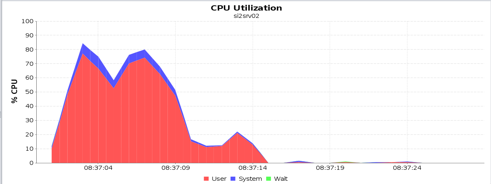

### Ejercicio 1

Seguimos todos los pasos indicamos y generamos el archivo *P2.jmx* incluido en la práctica. En este archivo no aparece en *View Results Tree*, pues fue añadido y eliminado posteriormente.

### Ejercicio 2

Al estar en casa y tener un único PC con linux instalado, no hemos podido usar dos ordenadores físicos distintos para probar la práctica. El subdelegado de clase habló con el profesor de prácticas y parece que valía con ejecutar todo en un único PC. En este caso, la dirección IP asignada a dicho PC es *192.168.1.160*.

Seguimos entonces los pasos para preparar el entorno de ejecución de pruebas adaptado a un único PC:

- Detenemos el servidor GlassFish del PC físico e iniciamos las dos máquinas virtuales.
- Iniciamos Glassfish de ambas máquinas virtuales y replegamos las aplicaciones anteriores para evitar posibles errores.
- Cambiamos la variable *name* del fichero *build.propierties* de *P1-ba*se para que pase a ser *P1-base* en vez de *P1*.
- Modificamos los ficheros *build.propierties* para indicar las nuevas direcciones IPs en las que tenemos que desplegar las aplicaciones.
- Desplegamos entonces cada una de las aplicaciones.

Tras esto, detenemos PostgreSQL en la máquina virtual con IP acabada en 2, y ejecutamos el comando *free* en el PC y en las dos máquinas virtuales, obteniendo las tres siguientes capturas respectivamente:


Entonces, hacemos lo propio con el comando *nmon*, pulsando la tecla *m* para obtener información de la RAM, y obtenemos:


**TODO: COMENTAR ESTAS CAPTURAS**

Como menciona el enunciado, ejecutamos un pago con cada una de las aplicaciones recién desplegadas, y comprobamos que las tres funcionan correctamente.

### Ejercicio 3

Tras desplegar la base de datos actualizada en todas las aplicaciones, lanzamos JMeter y ejecutamos los tests de manera satisfactoria (después de solucionar unos cuantos errores en el fichero *.csv* dado), de forma que obtenemos los siguientes resultados en *JMeter*:


Además, sabemos que la ejecución ha sido correcta por el resultado de `SELECT COUNT(*) FROM PAGO;` en Tora, que es siguiente:


Tras esto, usamos *scp* para pasar el archivo *server.log* de la máquina *10.1.2.2* al PC, y lo incluimos en la entrega de la práctica.

Observando los resultados obtenidos vemos que el mejor resultado es el de `P1-base` pues tiene unos tiempo significativamente más bajos, en todos los casos salvo el máximo (pero teniendo en cuenta que el valor del 99% es muy bajo este máximo puede haber sido un caso aislado). Además tiene una velocidad de datos recibidos mucho más alta que los otros, y un throughoutput también mucho más alto.

Esto se debe a que en `P1-base` tanto el servidor como el cliente se despliegan en la misma máquina virtual, reduciendo mucho el tiempo que tardan en enviarse las peticiones del cliente al servidor pues no necesitan deplazarse por la red.

Para escoger este resultado observaría especialmente la columna del throughoutput pues es la que indica más fielmente el rendimiento.

Si deshabilitamos los tests de *P1-ws* y *P1-base* y modificamos el de *P1-ejb* para que ejecute las pruebas del EJB local incluido en *P1-ejb-servidor-remoto* obtenemos los siguientes resultados:


Como era de esperar, hay una reducción considerable en todos los tiempos respecto a los tests anteriores de *P1-ejb*. Esto se debe a que en este caso, el cliente estaba en la misma máquina virtual que el servidor, ahorrándose así la comunicación por la red, entre otras muchas cosas, y optimizando el proceso a costa de ser un sistema menos distribuido. Tamien es mejor en este caso que la `P1-base` en el caso anterior pues en este caso la base de datos también se encentra desplegada en la misma máquina virtual.

### Ejercicio 4

**TODO REDACTAR BIEN**

El comando que se debe ejecutar para averiguar el `max queue size` es:
```bash
asadmin get --user admin --monitor server.network.http-listener-1.connection-queue.countqueued-count
```

El comando que se debe ejecutar para averiguar el `max pool size` es:
```bash
asadmin get --user admin --monitor server.resources.VisaPool.numconnused-current
```

El comando para monitorizar el número de errores en las peticiones al servidor web es:

```bash
asadmin monitor --type httplistener --user admin server
```

Y en la salida miramos al valor de `ec`, que es el `error count`.

### Ejercicio 6



Observando los resultados, consideramos que el proceso consume más CPU que cualquier otro recursos, llegando a usar más del 80% del rendimiento de esta en algunos momentos. Para solucionar este problema, una posibilidad sería emplear otro esquema de despliegue que tenga una mayor distribución con el cliente y el servidor en 2 máquinas virtuales diferentes, como es el caso implementado en P1-ws, aunque este aumentaría el coste de tiempo al tener que enviarse las peticiones por la red.

La situación simulada en este ejercico es muy poco realista debido a que durante la simulación JMeter usa un único hilo, por lo que se está imulando un caso en que únicamente hay 1 usuario conectado, mismo motivo por el que es normal que la cola no esté vacía.

### Ejercicio 8

A partir de 1750 hilos se puede ver como aumenta la latencia, con lo que a pesar de que la productividad sigue aumentando, las peticiones se resuelven cada vez más despacio.

Desde 2000 a 2500 el rendimiento crece cada vez más lento. El cambio posterior es muy brusco, pero se han tomado varias pruebas y los resultados han sido en todos los casos muy similares.

A partir de 2500 hilos se puede apreciar una bajada de rendimiento. Esto se debe probablemente a dos causas: por un lado, el servidor ha pasado ya la zona lineal de funcionamiento, y posiblemente la de transición, con lo que el rendimiento crece mucho más lento, y por otro lado, al tener que hacer la práctica en un único ordenador, que está usano dos máquinas virtuales y 2500 hilos, este se está saturando (para ver esto hay que mirar el nmon del ordenador en estas carpetas, observando como funciona la cpu en las de alrededor, y poniendo capturas que lo expliquen todo bien.)

Con 3250 aparecen los primeros errores de sockets en JMeter, lo que significa que el servidor está saturado.

TODO: REVISAR

### Ejercicio 9

A la vista de los resultados obtenidos en la curva del ejercicio anterior es complicado establecer el número de usuarios a partir del cual se inicia la región de saturación, debido a que a partir de cierto punto disminuye considerablemente el redimiento pues la práctica se realiza en un único ordenador y este llega por tanto antes de lo esperado al límite de su rendimiento. Por tanto estimamos que la región de saturación se encuentra a partir de los 3250 usuarios concurrentes, pues es cuando comienzan a aparecer errores de sockets en JMeter. En este punto el throughoutput total es de 342/s, que es a su vez el throughoutput más alto de la zona de saturación debido a que el rendimiento decrece por la saturación del único ordenador que ejecuta la práctica.

Observando los parámetros de monitorización, vemos que el que llega a su máximo en este punto es el número de conexiones a procesar simultńeamente por el servidor, es decil el `HTTP thread pool size` , por tanto este es el parámetro que se debería ampliar si se quiere que el punto de saturación se encuentre a partir de un número mayor de usuarios.

TODO: PROBARLO 