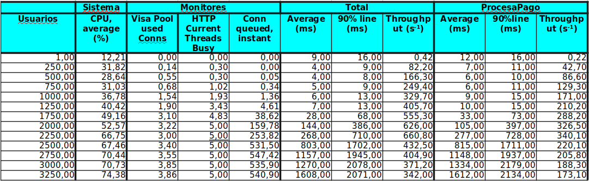
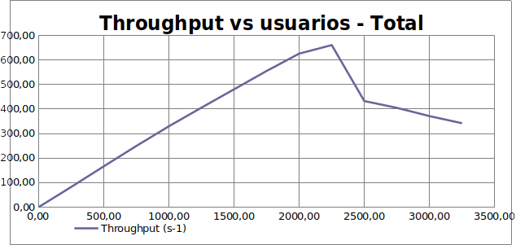
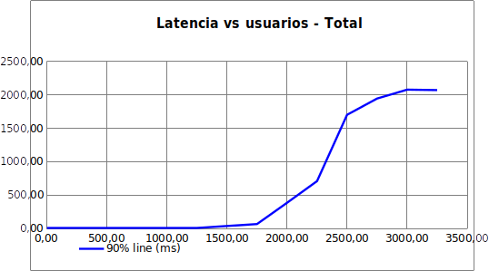
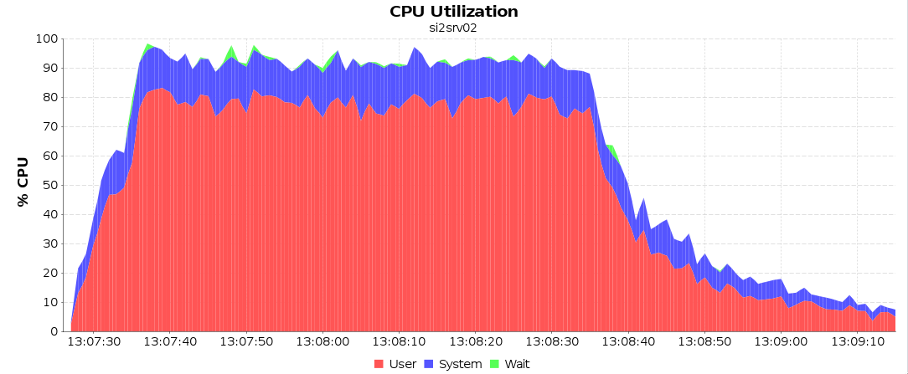
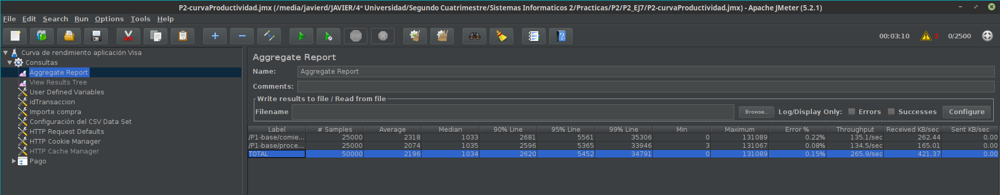

### Ejercicio 1

Seguimos todos los pasos indicamos y generamos el archivo *P2.jmx* incluido en la práctica. En este archivo no aparece en *View Results Tree*, pues fue añadido y eliminado posteriormente como indica el enunciado.

### Ejercicio 2

Al estar en casa y tener un único PC con Linux instalado, no hemos podido usar dos ordenadores físicos distintos para probar la práctica. El subdelegado de clase habló con el profesor de prácticas y parece que valía con ejecutar todo en un único PC. En este caso, la dirección IP asignada a dicho PC es *192.168.1.160*.

Seguimos entonces los pasos para preparar el entorno de ejecución de pruebas adaptado a un único PC:

- Detenemos el servidor GlassFish del PC físico e iniciamos las dos máquinas virtuales.
- Iniciamos Glassfish de ambas máquinas virtuales y replegamos las aplicaciones anteriores para evitar posibles errores.
- Cambiamos la variable *name* del fichero *build.propierties* de *P1-ba*se para que pase a ser *P1-base* en vez de *P1*.
- Modificamos los ficheros *build.propierties* para indicar las nuevas direcciones IPs en las que tenemos que desplegar las aplicaciones.
- Desplegamos entonces cada una de las aplicaciones.

Tras esto, detenemos PostgreSQL en la máquina virtual con IP acabada en 2, y ejecutamos el comando *free* en el PC y en las dos máquinas virtuales, obteniendo las tres siguientes capturas respectivamente:


Entonces, hacemos lo propio con el comando *nmon*, pulsando la tecla *m* para obtener información de la RAM, y obtenemos:


A la vista de estos resultados vemos que durante la ejecución del proceso el consumo de espacio de RAM es mucho mayor en el ordenador físico que en ambas máquinas virtuales, esto es lógico ya que el ordenador físico está ejecutando ambas máquinas además de otros procesos abiertos en este para realizar la práctica (editor de texto, nmon...). A pesar de esto observamos que en ambas máquinas, el procedimiento tiene un alto consumo de ram llegando incluso a ocupar un 70% de la capacidad de esta en la máquina virtual 2 que contiene el servidor. Es lógico también que la máquina virtual 2 tenga un mayor consumo de ram que la 1, ya que la máquina 2 contiene todo el servidor de la aplicación, mientras que la máquina virtual 1 tan solo contiene la base de datos.

Como menciona el enunciado, ejecutamos un pago con cada una de las aplicaciones recién desplegadas, y comprobamos que las tres funcionan correctamente.

### Ejercicio 3

Tras desplegar la base de datos actualizada en todas las aplicaciones, lanzamos JMeter y ejecutamos los tests de manera satisfactoria (después de solucionar unos cuantos errores en el fichero *.csv* dado), de forma que obtenemos los siguientes resultados en *JMeter*:


Además, sabemos que la ejecución ha sido correcta por el resultado de `SELECT COUNT(*) FROM PAGO;` en Tora, que es siguiente:


Tras esto, usamos *scp* para pasar el archivo *server.log* de la máquina *10.1.2.2* al PC, y lo incluimos en la entrega de la práctica.

Observando los resultados obtenidos vemos que el mejor resultado es el de `P1-base` pues tiene unos tiempo significativamente más bajos, en todos los casos salvo el máximo (pero teniendo en cuenta que el valor del 99% es muy bajo este máximo puede haber sido un caso aislado). Además tiene una velocidad de datos recibidos mucho más alta que los otros, y un throughoutput también mucho más alto.

Esto se debe a que en `P1-base` tanto el servidor como el cliente se despliegan en la misma máquina virtual, reduciendo mucho el tiempo que tardan en enviarse las peticiones del cliente al servidor pues no necesitan deplazarse por la red.

Para escoger este resultado observaría especialmente la columna del throughoutput pues es la que indica más fielmente el rendimiento. Además, en un servicio como el que ofrece esta práctica, la latencia no es un factor importante como podría ser en un servicio de vídeo en tiempo real.

Entre la *P1-ws* y *P1-ejb* elegiríamos la segudna, pues presenta una latencia considerablemente menor con un throughoutput mucho mayor.

Finalmente, si deshabilitamos los tests de *P1-ws* y *P1-base* y modificamos el de *P1-ejb* para que ejecute las pruebas del EJB local incluido en *P1-ejb-servidor-remoto* obtenemos los siguientes resultados:


Como era de esperar, hay una reducción considerable en todos los tiempos respecto a los tests anteriores de *P1-ejb*. Esto se debe a que en este caso, el cliente estaba en la misma máquina virtual que el servidor, ahorrándose así la comunicación por la red, entre otras muchas cosas, y optimizando el proceso a costa de ser un sistema menos distribuido. También es mejor en este caso que la `P1-base` en el caso anterior pues en este caso la base de datos se encuentra desplegada en la misma máquina virtual.

### Ejercicio 4

Como nos indica el enunciado, adaptamos la configuración del servidor a los parámetros especificados, tras lo cual guardamos el archivo de configuración `domain.xml` incluido en el entregable de la práctica.

Observamos el archivo `si-monitor.sh` y la documentación del comando asadmin en busca de los comandos que se emplean para las acciones que se nos piden y descubrimos que son los siguientes.

El comando que se debe ejecutar para averiguar el `max queue size` es:

```bash
asadmin get --user admin --monitor server.network.http-listener-1.connection-queue.countqueued-count
```

El comando que se debe ejecutar para averiguar el `max pool size` es:
```bash
asadmin get --user admin --monitor server.resources.VisaPool.numconnused-current
```

El comando para monitorizar el número de errores en las peticiones al servidor web es:

```bash
asadmin monitor --type httplistener --user admin server
```

Y en la salida miramos al valor de `ec`, que es el `error count`.

### Ejercicio 6

Adjuntamos en la carpeta *Ejercicio6* los documentos *.nmon* de PC y máquina virtual junto con la captura del monitor que respaldan los resultados obtenidos.


Observando los resultados, consideramos que el proceso consume más CPU que cualquier otro recursos, llegando a usar más del 80% del rendimiento de esta en algunos momentos. Para solucionar este problema, una posibilidad sería emplear otro esquema de despliegue que tenga una mayor distribución con el cliente y el servidor en 2 máquinas virtuales diferentes, como es el caso implementado en P1-ws, aunque este aumentaría el coste de tiempo al tener que enviarse las peticiones por la red.

La situación simulada en este ejercicio es muy poco realista debido a que durante la simulación JMeter usa un único hilo, por lo que se está simulando un caso en que únicamente hay 1 usuario conectado, mismo motivo por el que es normal que la cola no esté vacía.

### Ejercicio 8

Tras realizar todos los pasos indicados en el enunciado para realizar la ejecución de la prueba y realizar la curva de productividad, introducimos todos los datos obtenidos en la tabla de la hoja de cálculo proporcionada, obteniendo la siguiente tabla como resultado.



Observando los resultados de la taba así como las siguientes gráficas resultantes:





Para respaldar todos los datos obtenidos en las pruebas, incluimos la carpeta *Ejercicio8* con la práctica. En esta carpeta hay una subcarpeta para cada uno de los tests que hemos ejecutado, cuyo nombre es *C\<NClientes>*. Dentro de cada una de estas subcarpetas se proporcionan capturas con los resultados de JMeter, de *monitor.sh* y los archivos *.nmon* obtenidos en el PC y en la máquina virtual, junto con una captura de NMonVisualizer de la CPU en la máquina virtual.

Comentar que a pesar de que la bajada de rendimiento que se puede apreciar a partir de los 2250 hilos es muy brusca, se han tomado varias pruebas y los resultados han sido siempre similares. Esto se debe probablemente a dos causas: por un lado, el servidor ha pasado ya la zona lineal de funcionamiento, con lo que el rendimiento crece mucho más despacio, y por otro lado, al tener que hacer la práctica en un único ordenador, que está usando dos máquinas virtuales y más de 2000 hilos, este se está saturando, cosa que se puede ver en los registros de CPU de la máquina virtual obtenidos por *nmon*, y de la RAM del PC host obtenidos por *nmon* también. 

Con 3250 aparecen los primeros errores de sockets en JMeter, lo que significa que el servidor está completamente saturado en nuestro caso, con lo que finalizamos las pruebas.

### Ejercicio 9

> A partir de la curva obtenida, determinar para cuántos usuarios conectados se produce el punto de saturación, cuál es el throughput que se alcanza en ese punto, y cuál el throughput máximo que se obtiene en zona de saturación

A la vista de los resultados obtenidos en la curva del ejercicio anterior es complicado establecer el número de usuarios a partir del cual se inicia la región de saturación, debido a que a partir de cierto punto disminuye considerablemente el rendimiento pues la práctica se realiza en un único ordenador que tiene que ejecutar la máquina virtual en la que corre el servidor web que procesa todas las peticiones, y correr simultáneamente los hilos que hacen dichas peticiones, por lo que el servidor llega antes de lo esperado al límite de su rendimiento. 

Esto se puede apreciar claramente en los ficheros *.nmon* obtenidos para los valores más altos del número de clientes, donde se aprecia que la CPU de la máquina virtual está al límite de su capacidad (se muestra la captura con 3000 clientes).



Otra forma de apreciar que el límite no está en el servidor web en sí, es ver la gráfica de latencia y tener en cuenta los datos obtenidos con el monitor: la cola del servidor no es el factor limitante en ningún momento, pues viendo las estadisticas devueltas por el monitor, hay una media de 500 clientes en cola, y el límite son 4096, aun así, se ve como la latencia alcanza un límite superior. Esto se debe a que el PC no puede correr todos los hilos de forma simultánea mientras ejecuta la máquina virtual.

En nuestro caso concreto, a la vista de los datos mostrados en las tablas y gráficos del ejercicio anterior, el punto de saturación se encuentra entre los 2250 y 2500 usuarios, donde se alcanza el pico de máximo throughoutput, unos 660 peticiones/segundo, que se corresponde además con el valor máximo alcanzado en toda la zona de saturación, pues a partir de este punto empieza a decaer.

A partir de estos datos, lo único que podemos hacer es elucubrar sobre cuál habría sido el comportamiento en la situación ideal en la que el servidor estuviese corriendo en un PC físico distinto. Para ello, observando las gráficas de throughoutput y de latencia, se aprecia que en el paso de 2000 a 2250 clientes, el crecimiento del throughoutput empieza a decaer lentamente, y la latencia crece, por lo que posiblemente el punto de saturación (en el caso en que el servidor corriese en un sistema independiente al de los clientes) estuviese alrededor de unos 3000 clientes. 

En este caso, el throughoutput máximo se alcanzaría sin embargo cuando el número de clientes tendiese a infinito, en el punto en que el factor limitante del servidor fuesen las colas de espera, de forma que algunos de los clientes empezasen a quedar sin contestación. Este throughoutput máximo sería sin ninguna duda superior a los 660 clientes/segundo mencionados anteriormente.

> Analizando los valores de monitorización que se han ido obteniendo durante la elaboración de la curva, sugerir el parámetro del servidor de aplicaciones que se cambiaría para obtener el punto de saturación en un número mayor de usuarios.

Como hemos mencionado anteriormente, en nuestro caso el techo límite del servidor no se alcanza por el servidor en sí, si no por tener que correr simultáneamente en un mismo sistema todos los clientes que hacen las peticiones y el servidor que las contesta. Por tanto, a pesar de cambiar la configuración del servidor, es poco probable que consigamos mejorar significativamente su rendimiento.

Sin embargo, observando los parámetros de monitorización, vemos que el que llega a su máximo en este punto es el número de conexiones a procesar simultáneamente por el servidor, es decir el `HTTP thread pool size` , por tanto este es el parámetro que se debería ampliar si se quiere que el punto de saturación se encuentre a partir de un número mayor de usuarios.

> Realizar el ajuste correspondiente en el servidor de aplicaciones, reiniciarlo y tomar una nueva muestra cercana al punto de saturación. ¿Ha mejorado el rendimiento del sistema? Documente en la memoria de prácticas el cambio realizado y la mejora obtenida.

Modificamos entonces dicho valor en el servidor GlassFish, extableciendo los parámetros Max Thread Pool Size y Min Thread Pool Size a 10 en vez de a los 5 anteriores. Tras esto, reiniciamos el servidor, borramos la base de datos desde Tora, y hacemos una prueba desde JMeter con 10 hilos para asegurar que el servidor estuviese completamente cargado y volvemos a borrar la base de datos.

Ejecutamos entonces el test con los 2500 usuarios que han sido el punto en el que el sistema ha empezado a decaer, obteniendo los siguientes valores en JMeter:



Como podemos ver, el rendimiento ha bajado a pesar de haber aumentado el número de conexiones. Esto demuestra que el problema no es el servidor en sí, sino la saturación del PC Host al crear y gestionar los hilos con la máquina virtual. Se puede apreciar además que hemos obtenido dos errores de clientes a los que el servidor no ha respondido por estar saturado.

Mencionar que tras extrañarnos estos resultados, hemos vuelto a establecer los valores modificados a los originales, reiniciado el servidor, hecho una prueba con un único cliente para asegurar que el servidor estuviese cargado completamente, y repetido la prueba con los 2500 hilos, obteniendo en este caso resultados muy similares a los mostrados en la tabla del ejercicio 8.