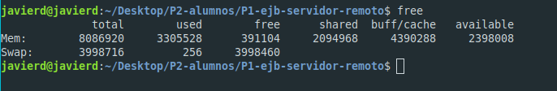
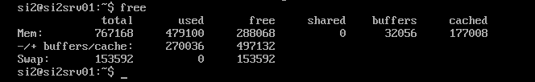
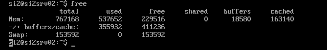
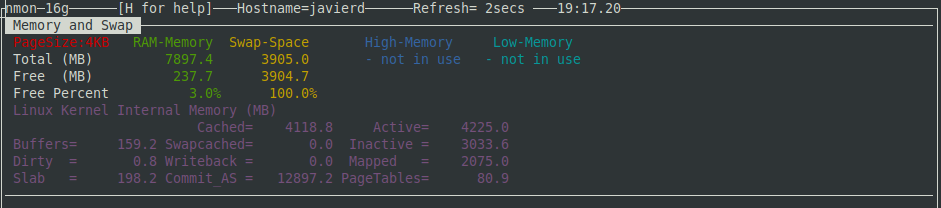
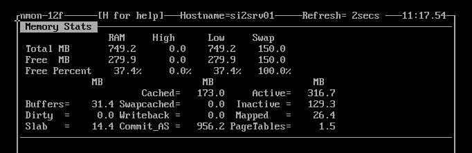
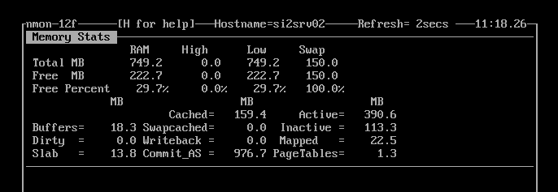
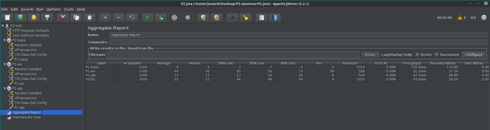
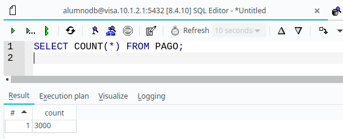
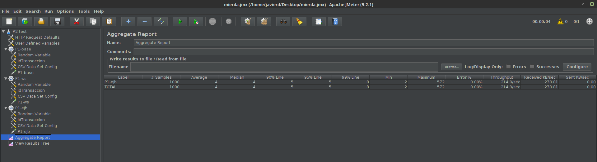

### Ejercicio 1

Seguimos todos los pasos indicamos y generamos el archivo *P2.jmx* incluido en la práctica. En este archivo no aparece en *View Results Tree*, pues fue añadido y eliminado posteriormente.

### Ejercicio 2 - TODO: REVISAR EXPLICACION

Al estar en casa y tener un único PC con linux instalado, no hemos podido usar dos ordenadores físicos distintos para probar la práctica. El subdelegado de clase habló con el profesor de prácticas y parece que valía con ejecutar todo en un único PC. En este caso, la dirección IP asignada a dicho PC es *192.168.1.160*.

Seguimos entonces los pasos para preparar el entorno de ejecución de pruebas adaptado a un único PC:

- Detenemos el servidor GlassFish del PC físico e iniciamos las dos máquinas virtuales.
- Iniciamos Glassfish de ambas máquinas virtuales y replegamos las aplicaciones anteriores para evitar posibles errores.
- Cambiamos la variable *name* del fichero *build.propierties* de *P1-ba*se para que pase a ser *P1-base* en vez de *P1*.
- Modificamos los ficheros *build.propierties* para indicar las nuevas direcciones IPs en las que tenemos que desplegar las aplicaciones.
- Desplegamos entonces cada una de las aplicaciones.

Tras esto, detenemos PostgreSQL en la máquina virtual con IP acabada en 2, y ejecutamos el comando *free* en el PC y en las dos máquinas virtuales, obteniendo las tres siguientes capturas respectivamente:

Entonces, hacemos lo propio con el comando *nmon*, pulsando la tecla *m* para obtener información de la RAM, y obtenemos:

**TODO: COMENTAR ESTAS CAPTURAS**

Como menciona el enunciado, ejecutamos un pago con cada una de las aplicaciones recién desplegadas, y comprobamos que las tres funcionan correctamente.

### Ejercicio 3

Tras desplegar la base de datos actualizada en todas las aplicaciones, lanzamos JMeter y ejecutamos los tests de manera satisfactoria (después de solucionar unos cuantos errores en el fichero *.csv* dado), de forma que obtenemos los siguientes resultados en *JMeter*:

Además, sabemos que la ejecución ha sido correcta por el resultado de `SELECT COUNT(*) FROM PAGO;` en Tora, que es siguiente:

Tras esto, usamos *scp* para pasar el archivo *server.log* de la máquina *10.1.2.2* al PC, y lo incluimos en la entrega de la práctica.

### TODO: ¿Cuál de los resultados le parece el mejor? ¿Por qué? ¿Qué columna o columnas elegiría para decidir este resultado?

Si deshabilitamos los tests de *P1-ws* y *P1-base* y modificamos el de *P1-ejb* para que ejecute las pruebas del EJB local incluido en *P1-ejb-servidor-remoto* obtenemos los siguientes resultados:

Como era de esperar, hay una reducción considerable en todos los tiempos respecto a los tests anteriores de *P1-ejb*. Esto se debe a que en este caso, el cliente estaba en la misma máquina virtual que el servidor, ahorrándose así la comunicación por la red, entre otras muchas cosas, y optimizando el proceso a costa de ser un sistema menos distribuido. **TODO COMPLETAR**

