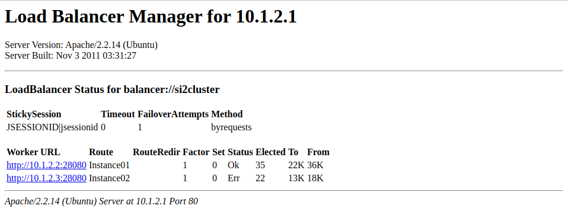

### Ejercicio 1

Tras crear las claves privada y pública, enviamos la clave pública a las dos máquinas virtuales usando el comando scp, y las insertamos en el fichero `~/.ssh/authorized_keys2` como se indica en el enunciado. Entonces, comprobamos que podemos conectarnos a ambas máquinas virtuales sin necesidad de introducir la contraseña:
Al ejecutar `ssh -v si2@10.1.2.2` obtenemos:

Al ejecutar `ssh -v si2@10.1.2.3` obtenemos:

No podemos mostrar que el comando introducido ha sido el mencionado, por las limitaciones del tamaño de pantalla de la máquina virtual, pero en ambos casos se aprecia que la conexión ha sido aceptada usando una clave pública, y que estamos conectados a la máquina virtual a la que nos hemos conectado.

### Ejercicio 2

TODO: Comentar

Podemos comprobar que ambas instancias del servidor están iniciadas:

Y, si observamos los PIDs relacionados con java de ambas máquinas virtuales, vemos que solo corre el Node almacenado en cada una de ellas.

### Ejercicio 3

Tras haber realizado todos los cambios, comprobamos desde la consola de administración de GlassFish los puertos de cada una de las instancias:

Hacemos un único pago en cada una de ellas, que se realizan correctamente, y comprobamos usando Tora que la información relativa a la dirección IP y nombre de la instancia se han almacenado correctamente.

### Ejercicio 4

En primer lugar, tras eliminar todas las cookies del navegador, y sin la propiedad *jvmRoute*, comprobamos que al intentar realizar un pago obtenemos un error, y esta es la información de la cookie almacenada:

Volvemos a borrar cookies, configuramos la propiedad *jvmRoute* y comprobamos que sí se pueden realizar pagos, obteniendo la siguiente cookie:

Como se puede comprobar la diferencia entre ambas cookies radica (además de en parámetros obvios como la hora) en la vaiable *JSESSIONID*, como era de esperar. En la primera prueba, es un identificador sin más que no determina la instancia del cluster en la que se está ejecutando la petición, mientras que en el segundo caso, el parámetro *JSESSIONID* está compuesto de *identificador.nombreDeInstancia*.

TODO: Completar bien y contestar a ¿Se podría, en general, usar el valor \${com.sun.aas.hostName} para la propiedad jvmRoute, en lugar de ${com.sun.aas.instanceName} ?

( No sé realmente qué se almacena en hostName. quizás si es el nombre del nodo sí se pueda. Hay que investigarlo bien).

### Ejercicio 5

TODO: Comentar bien

Usamos varios navegadores para enviar peticiones, y comprobamos que cada uno almacena un *JSESSIONID* que se refiere a una de las dos instancias, pero que permanece constante dentro del navegador, por lo que la propiedad *jvmRoute* funciona correctamente y la carga se balancea bien, como apreciamos en la página del *Load Balancer Manager*.

### Ejercicio 6

A partir de la captura anterior, vemos que la instancia2 es la que tiene menos elecciones. Usamos `ps –aef | grep java` para saber cual es el pid del proceso, y lo ejecutamos con `kill -9 pid`. 

Tras esto, plasmamos el estado de la base de datos antes de ejecutar ningún pago nuevo:

Usamos nuevas ventanas de incógnito dentro de los navegadores para hacer más pagos, y podemos comprobar de esta forma que la instancia 2 no está funcionando pues: todos los nuevos pagos aparecen en la bd como ejecutados en la instancia 1, y en el balanceador de carga aparece con error.

 

### Ejercicio 7

Usamos el comando `asadmin start-instance Instance02` para arrancar la instancia 2, hacemos más pagos, y podemos comprobar, tanto en la base de datos como en la página del balanceador de carga que la instancia 2 está activa otra vez.

### Ejercicio 8

Iniciamos una petición que resulta empezar en la instancia 2. Matamos la instancia y completamos el pago. 

Antes de finalizar el pago:

Despues:

Vemos como tras finalizar el pago (aunque haya sido incorrecto) la instancia indicada en *JSESSIONID* ha pasado a ser la 1, y la instancia 2 se ha marcado como erronea en el balanceador de carga. El pago es incorrecto porque para completarse utiliza el pago almacenado en la sesión, que obviamente no está disponible en la instancia 1, pues se estaba procesando en la 2. TODO: Explicar todo bien.

### Ejercicio 9

Usamos Tora para borrar la base de datos. 

Modificamos el script p2.jmx, entregado ahora como p3.jmx.

Establecemos la ip a `10.1.2.1`, borramos el Port Number,  dejamos un único Thread Group que se llama P3, establecemos 1 único hilo y 1000 pruebas (estableciendo la variable *samples* a 1000) y el *Path* a *P3/procesapago*. Tras esto, corremos el test y vemos que se ejecuta correctamente.

Usando Tora, comprobamos el resto de cosas: Se han realizado los mil pagos, la mitad con cada una de las instancias, y observando los pagos en el orden en que se han hecho, podemos ver como el algoritmo para mandar las peticiones a una instancia u otra de forma alterna, a uno cada vez. TODO: EXPLICAR BIEN.

