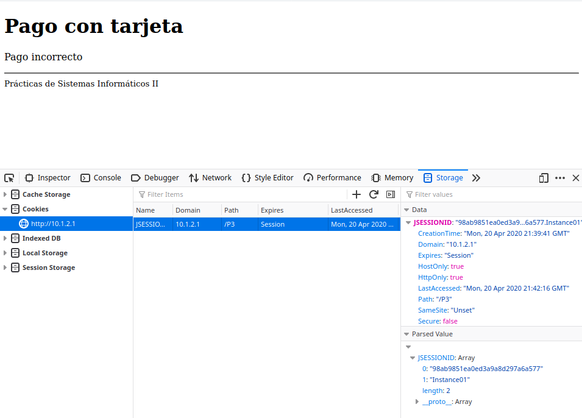

###### Javier Delgado del Cerro y Javier López Cano

# Memoria Practica 3 SI2

### Ejercicio 1

En primer lugar cramos y configramos correctamente las 3 máquinas virtuales necesarias para la práctica, y creamos en la primera las claves pública y privada.

Tras esto, enviamos la clave pública a las otras dos máquinas virtuales usando el comando scp, y las insertamos en el fichero `~/.ssh/authorized_keys2` como se indica en el enunciado. Entonces, procedemos a comprobar que podemos conectarnos a ambas máquinas virtuales sin necesidad de introducir la contraseña.

Probamos en primer lugar que se conecta correctamente a la segunda máquina virtual ejecutando el comando `ssh -v si2@10.1.2.2`, de este modo obtenemos la siguiente salida:


Del mismo modo, comprobamos que se conecta correctamente a la máquina vrtual 3 con el comando `ssh -v si2@10.1.2.3` y obtenemos:


Debido a las limitaciones en el tamaño de  la pantalla de la máquina virtual, nos es imposible mostrar en las capturas que el comando ejecutado es el mencionado anteriormente. Sin embargo, las capturas nos sirven para mostrar que, en ambos casos, la conexión ha sido aceptada con una clave pública, y que las máquinas virtuales se han conectado correctamente por ssh.

Por tanto, tras esto, realizamos copias de las tres máquinas virtuales y las guardamos para los siguientes ejercicios de la pŕactica.

### Ejercicio 2

Para comenzar este ejercicio iniciamos las 3 máquinas virtuales guardadas, nos conectamos mediante SSH a la primera y arrancamos glassfish en esta como nos  indica el enunciado con el comando `asadmin start-domain domain1`.

Tras esto procedemos a la creación del cluster configurando, en primer lugar, los nodos SSh de este. Siguiendo los pasos del enunciado iniciamos sesión SSH en la primer máquina y creamos el `Node01` indicando que este se va a ejecutar en la máquina `10.1.2.2` con el usuario `si2`. Realizamos el mismo proceso para el `Node02` que se ejecutará en la máquina `10.1.2.3`. Una vez ambos nodos están configurados, comprobamos que el proceso se ha realizado de forma correcta listandolos y realizando un ping a cada uno como nos indica el enunciado.

Pasamos ahora a crear el cluster con el comando: 

```bash
asadmin create-cluster SI2Cluster
```

Listamos el cluster para comprobar que se ha creado correctamente y comprobamos en el fichero `etc/hosts` de cada uno de los nodos que se conocen, es decir, que dichos ficheros tienen el nombre y la dirección IP de los nodos del cluster. Finalmente, como nos indica el enunciado, creamos 2 instancias, una a cada uno de los 2 nodos que habíamos creado, tras esto inciamos el cluster.

Entramos en la consola de administración de glassfish (de la IP `10.1.2.1`) para modificar la configuración del cluster estableciendo en `JVM Sttings -> JVM Options` las opciones de configuración que nos indica el enunciado, tras lo cual reiniciamos el cluster. 

El cluster estará ahora  creado y configurado, y, por tanto, procedemos a realizar las comprobaciones que se nos piden.

En primer lugar listamos las instancias del cluster para comprobar que se han iniciado correctamente:


Podemos comprobar que ambas instancias del servidor están iniciadas.

Observamos ahora los PIDs relacionados con java de ambas máquinas virtuales, y vemos que, como esperábamos, solo corre el Node almacenado en cada una de ellas.


Podemos comprobar con esto que el cluster se ha creado de forma correcta.

### Ejercicio 3

En primer lugar, realizamos  todos los cambios que nos indica el enunciado, que incluyen desactivar el modo debug, añadir a tabla pago de la base de datos las columnas `instancia` e `ip` y modificar los distintos Bean y el `VisaDAO` según sea necesario para que tomen en cuenta estos 2 nuevos campos. Del mismo modo cambiamos los ficheros `postgresql.xml`, `build.properties`, y `postgresql.properties` como nos indica el enunciado para el despliegue correcto en el cluster.

Tras esto desplegamos la aplicación con `ant todo`.

Comprobamos desde la consola de administración de GlassFish los puertos de cada una de las instancias:


Hacemos un único pago en cada una de ellas, que se realizan correctamente, y comprobamos usando Tora que la información relativa a la dirección IP y nombre de la instancia se han almacenado en los nuevos campos correspondientes.


Vemmos, de este modo, que el despliegue en el cluster se ha ealizado correctamente y la aplicación funciona de la manera esperada.

### Ejercicio 4

En primer lugar, tras eliminar todas las cookies del navegador, y sin la propiedad *jvmRoute*, comprobamos que al intentar realizar un pago obtenemos un error,y vemos que la información de la cookie almacenada es la siguiente:


Volvemos a borrar cookies, pero esta vez sí configuramos la propiedad *jvmRoute y vemos que, en esta ocasión, sí podemos realizar pagos, obteniendo la siguiente cookie almacenada:


Como se puede comprobar la diferencia entre ambas cookies radica (además de en parámetros obvios como la hora) en la vaiable *JSESSIONID*, como era de esperar. En la primera prueba, esta variable contiene tan solo un simple identificador que no determina la instancia del cluster en la que se está ejecutando la petición, mientras que en el segundo caso, el parámetro *JSESSIONID* está compuesto de *identificador.nombreDeInstancia*.

En general, no se puede usar el valor \${com.sun.aas.hostName} para la propiedad jvmRoute en lugar de ${com.sun.aas.instanceName} pues no tienen el mismo contenido. \${com.sun.aas.hostName} contiene el nombre de la máquina virtual que es el host del servicio, mientras que ${com.sun.aas.instanceName} contiene el nombre de la instancia en la que se ejecuta el servicio. Si bien ambos parámtros representan la máquina en que se está ejecutando el servicio, jvmRoute necesita el nombre de la instancia y no el de la máquina vortual. Por tanto el único caso en que se podrían usar ambos valores indistintamente es si el nombre de las instancias y de la máuina virtual en que se ejcutan es el mismo, y en nuesro caso, no lo es, pues las máquinas se llaman `si2srvX` y las instancias creadas `Instance0X`. Alternativamente al nombre de la instancia, jvmRoute puede emplear tambien el nombre del "worker" correspondiente a la instancia en caso de que se haya crado un fichero `workers.properties`, pero, como este no es nuestro caso, no lo tomamos en cuenta.

### Ejercicio 5

Enviamos varias peticiones  de pago contra el cluster desde varios navegadores como se nos indica en el enunciado. Tras esto, consultamos el *Load Balancer Manager* y vemos que cada uno de los navegadores empleados almacena un JSESSIONID que hace referencia a una de las 2 instancias del cluster, y que permanece constante dentro de cada navegador. Esto quiere decir que cada navegador realiza sus peticiones a una de las dos instancias, pero siempre, cada navegador, lo realiza a la misma instancia.


Esto nos indica que la propiedad *jvmRoute* funciona correctamente y la carga se balancea de la forma esperada.

### Ejercicio 6

A partir de la captura anterior, vemos que la instancia2 es la que tiene menos elecciones. Usamos `ps –aef | grep java` para saber cual es el pid del proceso, y lo ejecutamos con `kill -9 pid`. 


Tras esto, plasmamos el estado de la base de datos antes de ejecutar ningún pago nuevo:


Usamos nuevas ventanas de incógnito dentro de los navegadores para hacer más pagos, y podemos comprobar de esta forma que la instancia 2 no está funcionando pues: todos los nuevos pagos aparecen en la bd como ejecutados en la instancia 1, y en el balanceador de carga aparece con error.

 


### Ejercicio 7

Usamos el comando `asadmin start-instance Instance02` para arrancar la instancia 2, hacemos más pagos, y podemos comprobar, tanto en la base de datos como en la página del balanceador de carga que la instancia 2 está activa otra vez.


### Ejercicio 8

Como se nos indica en el enunciado, comenzamos una petición de pago y tras realizar la llamada al servlet `ComienzaPago`, comprobamos que esta comienza en la instancia 2. Procedemos entnces a matar la instancia 2 del mismo modo que en el ejercicio 6, tras esto completamos el pago obtenendo una salida que nos indica que el pago es incorrecto.

Antes de finalizar el pago el Load Balancer nos muestra que ambas instancias están funcionando de forma correcta y que las peticiones se están balanceando correctamente:


Sin emabrgo, tras completar el pago y recibir el mensaje de "Pago incorrecto", el Load Balancer nos muestra error en la instancia2 ya que la hemos detenido:




Tras finalizar el pago (aunque haya sido incorrecto) la instancia indicada en *JSESSIONID* ha pasado a ser la 1, y la instancia 2 se ha marcado como erronea en el balanceador de carga, como esperábamos.

El pago realizado en esta operación resulta incorrecto debido a que, para completarse el pago, se necesita tener el pago almacenado en la sesión, y este no está disponible en la instancia 1 que es la que se ha encargado de finalizar el pago, puesto que este ha sido iniciado por la instancia 2 que es la que tendrá estos datos almacenados en sesión. 

### Ejercicio 9

Para realizar estas pruebas correctamente, en primer lugar eliminamos todos los pagos previos al ciclo de pruebas, para ello eliminamos la base de datos empleando Tora. 

Modificamos el script p2.jmx, entregado ahora como p3.jmx.

Configuramos ahora la pantalla de pruebas de JMeter para realizar un ciclo de 1000 pruebas en un solo hilo a la Ip del cluster y la nueva URL como nos indica el enunciado, para ello establecemos la ip a `10.1.2.1`, borramos el Port Number,  dejamos un único Thread Group que se llama P3, establecemos 1 único hilo y 1000 pruebas (estableciendo la variable *samples* a 1000)  e introduciemos en el *Path* *"P3/procesapago"*. Tras esto, corremos el test y vemos que se ejecuta correctamente.


Usando Tora, comprobamos que el ciclo de tests se ha ejecutado correctamente comprobando que se han realizado 1000 pagos, 500 con cada una de las 2 instancias.


Observando detalladamente la distribución de los pagos realizados, vemos que el algoritmo manda un pago a cada una de las 2 instancias de forma alterna, distribuyendo estos de forma uniforme entre ambas, de modo que la craga de ambas instancias sea la misma.


Por tanto concluimos que se ha empleado un algoritmo de reparto equitativo y alterno entre las 2 instancias del cluster.